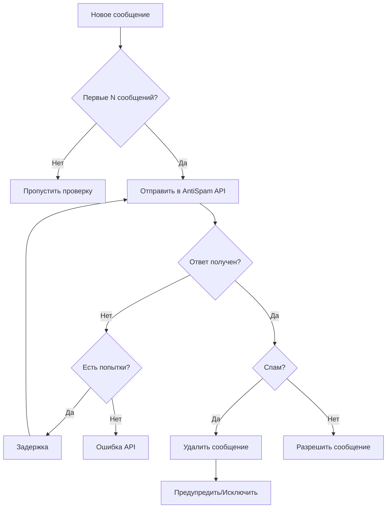

# 🛡️ Настройка системы антиспама

## 📋 Содержание

- [Обзор](#обзор)
- [Архитектура](#архитектура)
- [Конфигурация](#конфигурация)
- [Настройка API](#настройка-api)
- [Логика работы](#логика-работы)
- [Настройки сервиса](#настройки-сервиса)
- [Мониторинг](#мониторинг)
- [Отладка](#отладка)

## 🎯 Обзор

Система антиспама обеспечивает автоматическую проверку сообщений новых пользователей через внешний ИИ-сервис. Система анализирует первые несколько сообщений каждого нового участника группы и принимает соответствующие меры при обнаружении спама.

### Ключевые особенности:
- **Автоматическая проверка** первых сообщений новых пользователей
- **Внешний ИИ-анализ** через REST API
- **Система повторных попыток** при сбоях API
- **Гибкие настройки** таймаутов и лимитов
- **Детальное логирование** для мониторинга

## 🏗️ Архитектура

### Компоненты системы:
```typescript
AntiSpamService
├── HTTP клиент для API
├── Система повторных попыток
├── Обработка ошибок
├── Мониторинг состояния
└── Логирование событий
```

### Интеграция с ботом:
- Вызывается из `TelegramBotService` при получении сообщений
- Проверяет только первые `maxMessagesForSpamCheck` сообщений пользователя
- Результат анализа влияет на действия бота (удаление, предупреждение, исключение)

## ⚙️ Конфигурация

### Переменные окружения:

```env
# Обязательные
ANTISPAM_URL=https://your-antispam-api.com/check

# Опциональные (значения по умолчанию)
NODE_ENV=production
```

### Основные настройки:
```typescript
interface AntiSpamSettings {
  timeoutMs: number      // Таймаут запроса (5000мс)
  maxRetries: number     // Количество попыток (2)
  retryDelayMs: number   // Задержка между попытками (1000мс)
}
```

## 🔧 Настройка API

### Формат запроса к внешнему API:

**Endpoint:** `POST {ANTISPAM_URL}`

**Headers:**
```http
Content-Type: application/json
```

**Request Body:**
```json
{
  "text": "Проверяемое сообщение пользователя"
}
```

### Ожидаемый ответ:

**Success Response (200):**
```json
{
  "is_spam": false,
  "confidence": 0.95,
  "reason": "Clean message"
}
```

**Spam Detected (200):**
```json
{
  "is_spam": true,
  "confidence": 0.88,
  "reason": "Contains promotional links"
}
```

**Error Response (4xx/5xx):**
```json
{
  "error": "Description of the error",
  "code": "ERROR_CODE"
}
```

## 🔄 Логика работы

### Алгоритм проверки сообщений:

1. **Фильтрация пользователей**
   - Проверяется только первые N сообщений нового пользователя
   - Счетчик сообщений хранится в Redis/памяти

2. **HTTP запрос к API**
   - Отправка текста сообщения на анализ
   - Применение таймаута (`timeoutMs`)

3. **Обработка ответа**
   - Парсинг JSON ответа
   - Извлечение флага `is_spam` и дополнительной информации

4. **Система повторных попыток**
   - При сбое API выполняется `maxRetries` попыток
   - Между попытками задержка `retryDelayMs`

5. **Принятие решения**
   - Если спам: удаление сообщения и возможное исключение
   - Если не спам: сообщение остается

### Схема процесса:


## 🛠️ Настройки сервиса

### Параметры в Application.ts:
```typescript
const antiSpamSettings = {
  timeoutMs: 5000,        // 5 секунд на запрос
  maxRetries: 2,          // 2 попытки при сбое
  retryDelayMs: 1000,     // 1 секунда между попытками
}
```

### Параметры бота:
```typescript
const botSettings = {
  maxMessagesForSpamCheck: 5,  // Проверять первые 5 сообщений
  temporaryBanDurationSec: 40, // 40 секунд временной блокировки
  autoUnbanDelayMs: 5000,      // 5 секунд до автоматической разблокировки
}
```

### Константы из constants.ts:
```typescript
export const ANTI_SPAM_CONFIG = {
  TIMEOUT_MS: 5000,
  MAX_RETRIES: 2,
  RETRY_DELAY_MS: 1000,
} as const
```

## 📊 Мониторинг

### Проверка состояния:
```typescript
// Проверка здоровья сервиса
antiSpamService.isHealthy()  // true/false

// Получение настроек
antiSpamService.getSettings()

// Статистика (если реализована)
antiSpamService.getStats()
```

### Health Check:
```typescript
// Автоматическая проверка при запуске
await antiSpamService.healthCheck()
```

### Логирование:

**Уровни логов:**
- `INFO` - запуск/остановка сервиса, успешные проверки
- `WARN` - обнаружен спам, проблемы с конфигурацией
- `ERROR` - ошибки API, сбои парсинга ответов
- `DEBUG` - детальная отладочная информация

**Примеры логов:**
```
🛡️ Initializing anti-spam service...
✅ Anti-spam service started
🔍 Checking message for spam: Hello world!
🚨 Spam detected from user 123456: Contains promotional links
❌ Anti-spam API failed after 2 attempts: Network timeout
```

## 🐛 Отладка

### Включение отладочных логов:
```env
LOG_LEVEL=0  # Все логи включая DEBUG
```

### Тестирование API:
```typescript
// Тест подключения к API
await antiSpamService.testAntiSpam()
```

### Проверка конфигурации:
```typescript
console.log("ANTISPAM_URL:", config.ANTISPAM_URL)
console.log("Settings:", antiSpamService.getSettings())
```

### Частые проблемы:

1. **ANTISPAM_URL не настроен**
   ```
   ⚠️ ANTISPAM_URL not configured, service will be disabled
   ```
   **Решение:** Добавить `ANTISPAM_URL` в переменные окружения

2. **Таймаут API**
   ```
   ❌ Anti-spam API failed after 2 attempts: Network timeout
   ```
   **Решение:** Увеличить `timeoutMs` или проверить доступность API

3. **Неверный формат ответа**
   ```
   ❌ Failed to parse JSON response: SyntaxError
   ```
   **Решение:** Проверить соответствие API ожидаемому формату

4. **API возвращает ошибки**
   ```
   HTTP 500: Internal Server Error
   ```
   **Решение:** Проверить логи внешнего API, возможно проблема на их стороне

### Команды отладки:

```bash
# Проверка переменных окружения
echo $ANTISPAM_URL

# Тест API вручную
curl -X POST $ANTISPAM_URL \
  -H "Content-Type: application/json" \
  -d '{"text":"Test message"}'

# Мониторинг логов
tail -f logs/app.log | grep "ANTISPAM"
```

## 📈 Производительность

### Оптимизация:
- **Кеширование результатов** проверок (если необходимо)
- **Ограничение количества** одновременных запросов
- **Мониторинг времени отклика** API

### Метрики для отслеживания:
- Время ответа API
- Количество ошибок API
- Процент сообщений, помеченных как спам
- Количество исключенных пользователей

## 🔒 Безопасность

### Рекомендации:
- Используйте HTTPS для ANTISPAM_URL
- Настройте аутентификацию API (если поддерживается)
- Ограничьте доступ к внешнему API по IP
- Регулярно обновляйте URL API

### Защита от злоупотреблений:
- Лимит проверок на пользователя
- Ограничение размера проверяемого текста
- Мониторинг необычной активности

---

> 💡 **Следующие разделы**: [Команды бота](./TELEGRAM_BOT_COMMANDS.md) | [Архитектура](./ARCHITECTURE_OVERVIEW.md)
