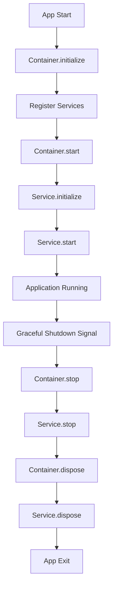

# 🏗️ Архитектура Telegram Bot "Альтрон"

## 📋 Обзор

Проект построен на современной модульной архитектуре с использованием принципов:
- **Dependency Injection** - управление зависимостями
- **Single Responsibility** - каждый компонент имеет одну ответственность
- **Event-Driven Architecture** - слабая связанность через события
- **Graceful Lifecycle** - корректное управление жизненным циклом

## 🎯 Архитектурные слои

### 1. Core Layer (src/core/)

Базовые архитектурные компоненты:

```typescript
// Container.ts - DI контейнер
export class Container {
  register<T>(name: string, factory: () => Promise<T>): void
  getAsync<T>(name: string): Promise<T>
  initialize(): Promise<void>
  start(): Promise<void>
  stop(): Promise<void>
  dispose(): Promise<void>
}

// Application.ts - оркестратор приложения
export class Application {
  async initialize(): Promise<void> // Регистрация сервисов
  async start(): Promise<void> // Запуск приложения
  async stop(): Promise<void> // Остановка приложения
}

// EventBus.ts - система событий
export class EventBus {
  emit<T>(event: string, data: T): void
  on<T>(event: string, handler: (data: T) => void): void
  off(event: string, handler: Function): void
}
```

### 2. Services Layer (src/services/)

Бизнес-сервисы, каждый реализует интерфейс `IService`:

```typescript
interface IService {
  name: string
  initialize: () => Promise<void> // Инициализация ресурсов
  start: () => Promise<void> // Запуск сервиса
  stop: () => Promise<void> // Остановка сервиса
  dispose: () => Promise<void> // Очистка ресурсов
  isHealthy: () => boolean // Проверка состояния
}
```

#### Основные сервисы:

- **TelegramBotService** - модульная система бота
- **AIChatServiceRefactored** - рефакторированный AI сервис
- **DatabaseService** - работа с PostgreSQL
- **RedisService** - кеширование
- **CaptchaService** - система капчи
- **AntiSpamService** - защита от спама
- **ApiServerService** - веб API сервер
- **ChatSettingsService** - управление настройками чатов
- **WeatherService** - прогноз погоды (опциональный)
- **EventBus** - система событий для слабой связности

### 3. Repository Layer (src/repository/)

Слой доступа к данным с использованием Drizzle ORM:

```typescript
// ChatRepository.ts
export class ChatRepository {
  async createChat(chatData: CreateChatData): Promise<Chat>
  async getChatById(chatId: number): Promise<Chat | null>
  async updateChatSettings(chatId: number, updates: Partial<ChatConfig>): Promise<void>
  async isChatActive(chatId: number): Promise<boolean>
}
```

## 🔧 TelegramBot Service - Модульная архитектура

Telegram бот построен по модульному принципу:

```
TelegramBot/
├── index.ts              # Главный класс TelegramBotService
├── core/
│   └── GramioBot.ts      # Обертка над GramIO
├── handlers/             # Обработчики событий
│   ├── MessageHandlerNew.ts # Обработка сообщений (плагинная архитектура)
│   ├── CommandHandler.ts # Обработка команд
│   ├── MemberHandler.ts  # Обработка входа/выхода участников
│   ├── CallbackHandler.ts# Обработка callback кнопок
│   └── ModerationEventHandler.ts # Обработка событий модерации
├── features/             # Функциональные модули
│   ├── MessageDeletionManager.ts # Автоудаление сообщений
│   ├── UserManager.ts    # Управление пользователями (Redis)
│   └── (plugins/)        # Плагины для обработки сообщений
├── adapters/             # Адаптеры Telegram
│   ├── ModerationAdapter.ts    # Единый слой модерации (ограничения/бан/кик/удаление)
│   └── CaptchaTelegramAdapter.ts # Отправка сообщений капчи
├── utils/                # Утилиты
│   ├── SettingsManager.ts# Управление настройками
│   ├── MessageFormatter.ts# Форматирование сообщений
│   └── Messages.ts       # Шаблоны сообщений
└── types/
    └── index.ts          # TypeScript типы
```

### Принципы модульности:

1. **Разделение ответственности** - каждый модуль отвечает за свою область
2. **Слабая связанность** - модули взаимодействуют через интерфейсы
3. **Расширяемость** - легко добавлять новые модули
4. **Тестируемость** - каждый модуль можно тестировать изолированно

## 🧠 Обработка сообщений: плагинная модель

Обработка сообщений реализована через `MessagePluginManager` и набор плагинов:

```
TelegramBot/plugins/
├── MessagePlugin.ts        # Интерфейс и базовый класс плагина
├── MessagePluginManager.ts # Регистрация и цепочка обработки
├── CommandPlugin.ts        # Обработка команд
├── SpamPlugin.ts           # Антиспам (первые N сообщений)
└── AIPlugin.ts             # Интеграция с AIChatService
```

Плагины сортируются по `priority` и вызываются последовательно, пока один из них не обработает событие.

## 🧠 AIChatService - Рефакторированная архитектура

AI сервис разделен на специализированные компоненты:

```
AIChatService/
├── AIChatServiceRefactored.ts # Главный оркестратор
├── providers/
│   ├── IAIProvider.ts         # Интерфейс AI провайдера
│   └── GeminiAdapter.ts       # Адаптер для Google Gemini
├── ChatConfigService.ts       # Управление настройками чатов
├── MessageProcessor.ts        # Обработка и валидация сообщений
├── AIResponseService.ts       # Генерация ответов AI
├── TypingManager.ts          # Управление индикаторами печати
├── ChatContextManager.ts     # Управление контекстами
├── ChatQueueManager.ts       # Управление очередями
├── AdaptiveThrottleManager.ts# Адаптивное троттлинг
├── ModerationTools.ts        # Инструменты модерации
└── interfaces.ts             # TypeScript интерфейсы
```

### Компоненты и их роли:

1. **AIChatServiceRefactored** - главный оркестратор, координирует работу всех компонентов
2. **ChatConfigService** - управление настройками чатов, API ключами
3. **MessageProcessor** - валидация, очистка упоминаний, подготовка сообщений
4. **AIResponseService** - взаимодействие с AI провайдером, генерация ответов
5. **TypingManager** - управление индикаторами "печатает"
6. **ChatContextManager** - управление контекстами диалогов с кешированием
7. **ChatQueueManager** - управление очередями сообщений
8. **AdaptiveThrottleManager** - адаптивное ограничение скорости запросов
9. **ModerationTools** - инструменты автоматической модерации

## 🎪 Event-Driven Architecture

Система событий обеспечивает слабую связанность компонентов:

```typescript
// Типы событий (src/types/events.ts)
export interface ModerationEvent {
  type: "delete_message" | "mute_user" | "ban_user" | "unban_user"
  chatId: number
  userId?: number
  messageId?: number
  duration?: number
  reason?: string
}

// Использование
eventBus.emit<ModerationEvent>("moderation:action", {
  type: "delete_message",
  chatId: -1001234567890,
  messageId: 12345,
  reason: "Spam content"
})
```

### События в системе:

- **moderation:action** - действия модерации
- **user:joined** - вход пользователя
- **user:left** - выход пользователя
- **message:spam** - обнаружен спам
- **captcha:solved** - капча решена
- **ai:response** - ответ AI готов

## 💾 Data Layer

### Database Schema (PostgreSQL + Drizzle ORM)

База данных PostgreSQL используется для хранения конфигурации чатов, настроек ИИ и информации об администраторах. Все операции выполняются через Drizzle ORM с автоматическим типизированием.

#### Таблица `chats`

Базовая информация о чатах Telegram.

| Поле | Тип | Описание |
|------|-----|----------|
| `id` | BIGINT | Telegram chat ID (PRIMARY KEY) |
| `type` | VARCHAR(50) | Тип чата: 'private', 'group', 'supergroup' (NOT NULL) |
| `title` | VARCHAR(255) | Название чата (может быть NULL для приватных чатов) |
| `active` | BOOLEAN | Активен ли чат в системе (default: true) |
| `created_at` | TIMESTAMP | Дата создания записи (default: NOW()) |
| `updated_at` | TIMESTAMP | Дата последнего обновления (default: NOW()) |

**Индексы:**
- `idx_chats_type` - по типу чата (`type`)
- `idx_chats_active` - по активности (`active`)

**Назначение:** Хранение базовой информации о зарегистрированных чатах. Используется для проверки активности чата и фильтрации по типу.

#### Таблица `chat_configs`

Конфигурация ИИ для каждого чата. Связь один-к-одному с таблицей `chats`.

| Поле | Тип | Описание |
|------|-----|----------|
| `chat_id` | BIGINT | ID чата (PRIMARY KEY, FK → chats.id) |
| `gemini_api_key` | VARCHAR(512) | API ключ Google Gemini для этого чата (может быть NULL) |
| `system_prompt` | JSONB | Системный промпт в формате JSON (см. структуру ниже) |
| `ai_enabled` | BOOLEAN | Включен ли ИИ в этом чате (default: true) |
| `created_at` | TIMESTAMP | Дата создания записи (default: NOW()) |
| `updated_at` | TIMESTAMP | Дата последнего обновления (default: NOW()) |

**Индексы:**
- `idx_chat_configs_ai_enabled` - по включению ИИ (`ai_enabled`)

**Структура `system_prompt` (JSONB):**
```typescript
{
  "основные правила"?: string,  // Основные правила поведения ИИ
  "характер"?: string,          // Характер и стиль общения
  "пол"?: string                // Пол персонажа ИИ
}
```

**Пример значения:**
```json
{
  "основные правила": "Будь вежливым и дружелюбным",
  "характер": "Веселый и общительный",
  "пол": "Мужской"
}
```

**Назначение:** Хранение настроек ИИ для каждого чата. API ключи хранятся per-chat (не глобально), что позволяет использовать разные ключи для разных групп.

#### Таблица `group_admins`

Список администраторов групп для проверки прав доступа.

| Поле | Тип | Описание |
|------|-----|----------|
| `group_id` | BIGINT | ID группы (NOT NULL, часть составного PRIMARY KEY) |
| `user_id` | BIGINT | ID пользователя-администратора (NOT NULL, часть составного PRIMARY KEY) |
| `created_at` | TIMESTAMP | Дата добавления администратора (default: NOW()) |

**Индексы:**
- `idx_group_admins_group` - по ID группы (`group_id`)
- `idx_group_admins_user` - по ID пользователя (`user_id`)

**Составной PRIMARY KEY:** (`group_id`, `user_id`)

**Назначение:** Кеширование списка администраторов групп для быстрой проверки прав доступа к командам модерации. Данные синхронизируются с Telegram API при регистрации группы.

### Кеширование (Многоуровневое)

Система использует двухуровневое кеширование для оптимизации производительности:

#### In-Memory Cache (CacheService)

Быстрый доступ к часто используемым данным в памяти процесса:

| Ключ | TTL | Описание | Константа |
|------|-----|----------|-----------|
| `chat:{chatId}` | 5 минут | Информация о чате | `CACHE_CONFIG.CHAT_TTL_SECONDS` |
| `chat_config:{chatId}` | 10 минут | Конфигурация ИИ чата | `CACHE_CONFIG.CHAT_CONFIG_TTL_SECONDS` |
| `user:{userId}` | 5 минут | Информация о пользователе | `CACHE_CONFIG.USER_TTL_SECONDS` |

**Инвалидация:** Автоматическая при обновлении/удалении данных через `ChatRepository.invalidateCache()`.

#### Redis Cache

Персистентное кеширование для масштабирования и восстановления после перезапуска:

| Ключ | TTL | Описание | Сервис |
|------|-----|----------|--------|
| `ai_context:{chatId}` | 24 часа | Контекст диалога ИИ | AIChatService |
| `user:{chatId}:{username}` | 7 дней | Маппинг username → user_id | UserManager |
| `user:{chatId}:{userId}` | 7 дней | Маппинг user_id → username | UserManager |
| `user:message_count:{chatId}:{userId}` | 48 часов | Счетчик сообщений для антиспама | AntiSpamService |
| `captcha:user:{userId}` | 5 минут | Данные активной капчи | CaptchaService |
| `deletion:{messageId}` | 1 час | Задачи на удаление сообщений | MessageDeletionManager |

**Особенности:**
- Автоматическая очистка по TTL
- Персистентность при перезапуске приложения
- Поддержка recovery для критичных данных (например, задачи удаления сообщений)

## 🔄 Жизненный цикл приложения



### Фазы жизненного цикла:

1. **Registration** - регистрация всех сервисов в Container
2. **Initialization** - создание экземпляров и инициализация ресурсов
3. **Start** - запуск всех сервисов
4. **Runtime** - основная работа приложения
5. **Stop** - корректная остановка сервисов
6. **Dispose** - освобождение всех ресурсов

## 🔗 Интеграции

### AI Providers

```typescript
interface IAIProvider {
  generateResponse: (request: AIRequest) => Promise<AIResponse>
  isHealthy: () => boolean
}

// GeminiAdapter.ts
export class GeminiAdapter implements IAIProvider {
  async generateResponse(request: AIRequest): Promise<AIResponse> {
    // Интеграция с Google Gemini API
  }
}
```

### External Services

- **AntiSpam API** - анализ сообщений на спам (используется плагином `SpamPlugin` для первых N сообщений)
- **LLAMA API** - дополнительная AI функциональность
- **Captcha Service** - генерация математических капч (интеграция через `MemberHandler` и `CallbackHandler`)
- **Weather API** - прогноз погоды (дополнительная функция)

## 🧪 Testing Architecture

```
__tests__/
├── unit/                 # Unit тесты
│   ├── core/            # Тесты архитектурных компонентов
│   └── services/        # Тесты сервисов
├── integration/         # Integration тесты
│   ├── AntiSpamFlow.test.js
│   ├── CaptchaFlow.test.js
│   └── GeminiAIFlow.test.js
├── setup.ts            # Настройка тестовой среды
└── README.md          # Документация тестов
```

### Принципы тестирования:

- **Unit тесты** - изолированное тестирование каждого компонента
- **Integration тесты** - тестирование взаимодействия компонентов
- **Mocking** - мокирование внешних зависимостей
- **Coverage** - контроль покрытия кода тестами

## 🚀 Scalability & Performance

### Адаптивное троттлинг

```typescript
// AdaptiveThrottleManager.ts
export class AdaptiveChatThrottleManager {
  // Token Bucket алгоритм с адаптивными параметрами
  // Автоматическая настройка задержек на основе длины ответов
  // Cleanup неактивных чатов
}
```

### Кеширование

- **Multi-level caching** - Redis + in-memory кеш
- **TTL-based invalidation** - автоматическое истечение кеша
- **Intelligent prefetching** - предзагрузка данных

### Queue Management

- **Per-chat queues** - отдельные очереди для каждого чата
- **Backpressure handling** - обработка перегрузок
- **Retry mechanisms** - повторные попытки при ошибках

## 🔒 Security

- **Input validation** - валидация всех входных данных
- **SQL injection protection** - использование ORM (Drizzle)
- **API key management** - безопасное хранение ключей
- **Rate limiting** - ограничение скорости запросов
- **Graceful error handling** - безопасная обработка ошибок

## 📊 Monitoring & Observability

- **Structured logging** - структурированные логи с уровнями
- **Health checks** - проверка состояния всех сервисов
- **Metrics collection** - сбор метрик производительности
- **Error tracking** - отслеживание и анализ ошибок
