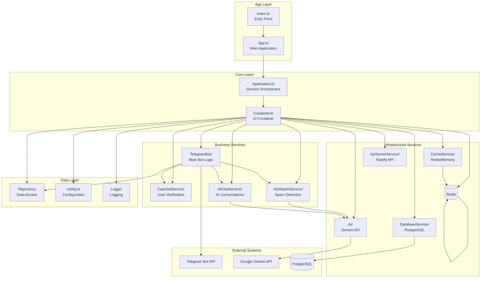
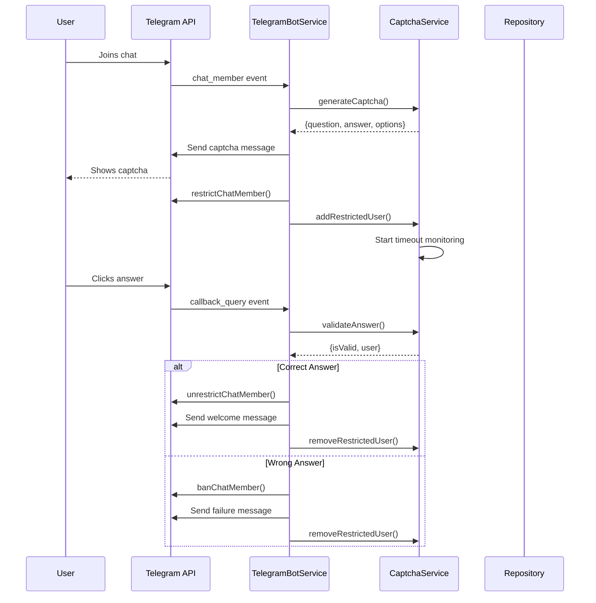
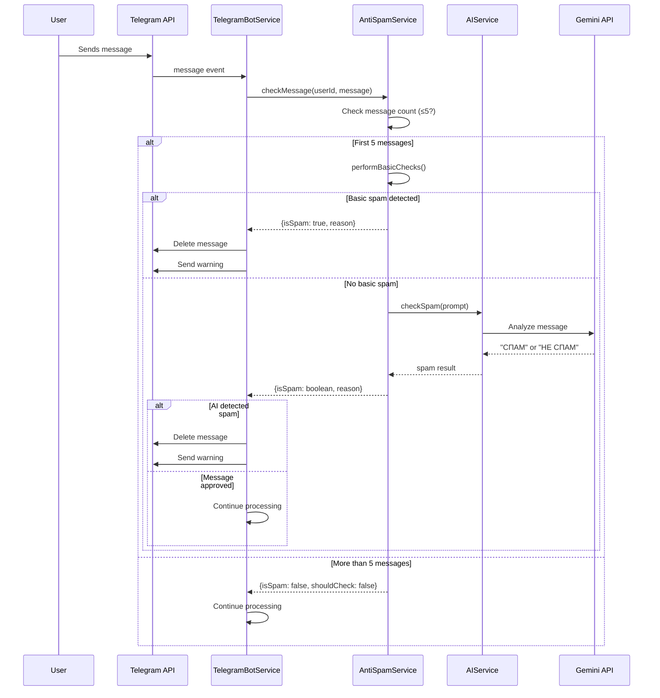
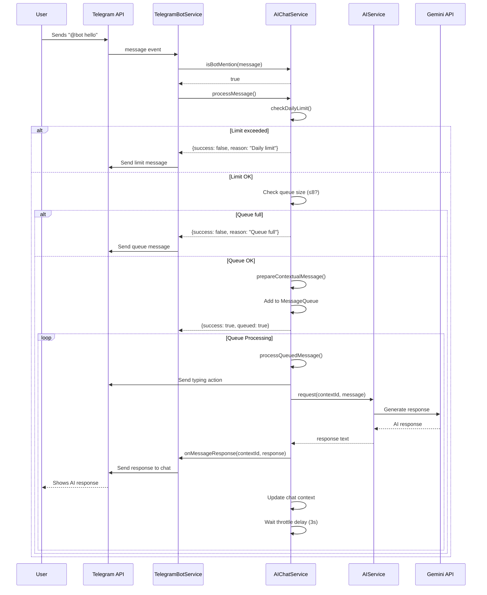
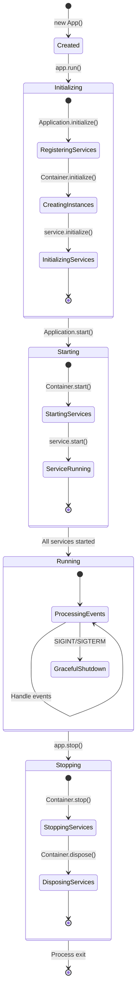
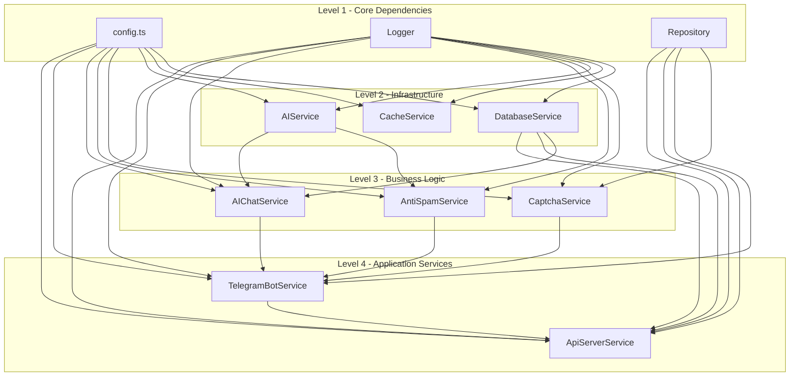
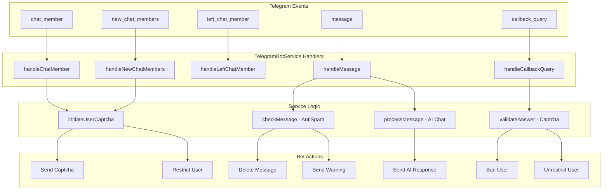
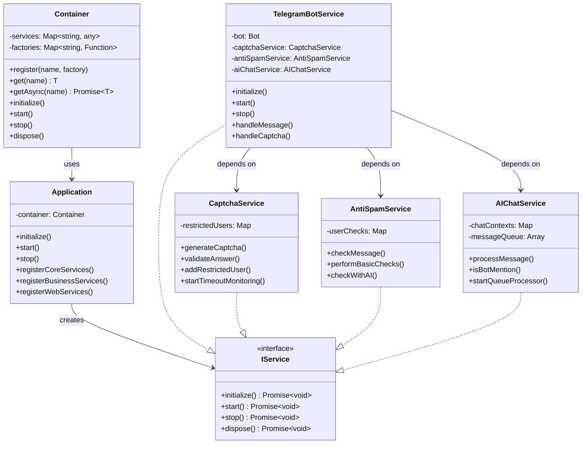

# 📊 Диаграмма архитектуры системы

## 🏗️ Общая архитектура

## 🔄 Поток данных - Капча

## 🛡️ Поток данных - Антиспам

## 🤖 Поток данных - AI Чат

## 🏗️ Lifecycle Управление

## 🔧 Dependency Graph

## 📡 Event Flow

## 🏭 Service Factory Pattern

---

*Диаграммы обновлены: 05.06.2025*  
*Версия: 2.0* 